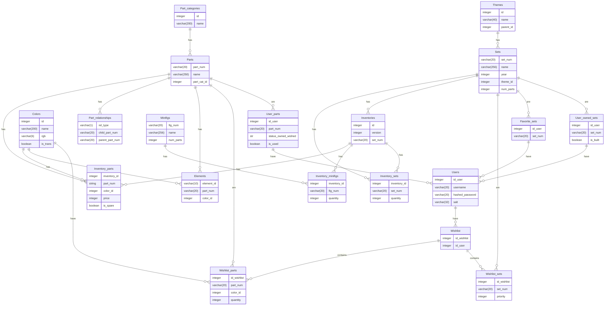

```mermaid
---
config:
  layout: dagre
---
erDiagram
	direction TB
	Inventories {
		integer id  ""  
		integer version  ""  
		varchar(20) set_num  ""  
	}

	Inventory_parts {
		integer inventory_id  ""  
		string part_num  ""  
		integer color_id  ""  
		integer price  ""  
		boolean is_spare  ""  
	}

	Parts {
		varchar(20) part_num  ""  
		varchar(250) name  ""  
		integer part_cat_id  ""  
	}

	Colors {
		integer id  ""  
		varchar(200) name  ""  
		varchar(6) rgb  ""  
		boolean is_trans  ""  
	}

	Part_categories {
		integer id  ""  
		varchar(200) name  ""  
	}

	Part_relationships {
		varchar(1) rel_type  ""  
		varchar(20) child_part_num  ""  
		varchar(20) parent_part_num  ""  
	}

	Elements {
		varchar(10) element_id  ""  
		varchar(20) part_num  ""  
		integer color_id  ""  
	}

	Inventory_minifigs {
		integer inventory_id  ""  
		varchar(20) fig_num  ""  
		integer quantity  ""  
	}

	Minifigs {
		varchar(20) fig_num  ""  
		varchar(256) name  ""  
		integer num_parts  ""  
	}

	Inventory_sets {
		integer inventory_id  ""  
		varchar(20) set_num  ""  
		integer quantity  ""  
	}

	Sets {
		varchar(20) set_num  ""  
		carchar(256) name  ""  
		integer year  ""  
		integer theme_id  ""  
		integer num_parts  ""  
	}

	Themes {
		integer id  ""  
		varchar(40) name  ""  
		integer parent_id  ""  
	}

	Users {
		integer id_user ""
		varchar(20) username ""
		varchar(20) hashed_password ""
		varchar(32) salt ""
	}
	
	Wishlist {
		integer id_wishlist ""
		integer id_user ""
	}
	
	Wishlist_parts {
		integer id_wishlist ""
		varchar(20) part_num ""
		integer color_id ""
		integer quantity ""
	}
	
	Wishlist_sets {
		integer id_wishlist ""
		varchar(20) set_num ""
		integer priority ""
	}
	
	Favorite_sets {
		integer id_user ""
		varchar(20) set_num ""
	}
	User_owned_sets { 
		integer id_user "" 
		varchar(20) set_num "" 
		boolean is_built "" 
	}
	User_parts { 
		integer id_user "" 
		varchar(20) part_num ""
		str status_owned_wished ""
		boolean is_used "" 
	}

	Inventories||--o{Inventory_parts:"has"
	Parts||--o{Inventory_parts:"has"
	Colors||--o{Inventory_parts:"has"
	Part_categories||--o{Parts:"has"
	Parts||--o{Part_relationships:"has"
	Parts||--o{Elements:"has" 
	Colors||--o{Elements:"has"
	Inventories||--o{Inventory_minifigs:"has"
	Minifigs||--o{Inventory_minifigs:"has"
	Inventories||--o{Inventory_sets:"has"
	Sets||--o{Inventory_sets:"has"
	Sets||--o{Inventories:"has"
	Themes||--o{Sets:"has"
	Users||--o{Wishlist:"have"
	Wishlist||--o{Wishlist_parts:"contains"
	Wishlist||--o{Wishlist_sets:"contains"
	Parts||--o{Wishlist_parts:"are"
	Colors||--o{Wishlist_parts:"have"
	Sets||--o{Wishlist_sets:"are"
	Favorite_sets||--o{Users:"have"
	User_owned_sets||--o{Users:"have"
	User_parts||--o{Users:"have"
	Sets||--o{Favorite_sets:"are"
	Sets||--o{User_owned_sets:"are"
	Parts||--o{User_parts:"are"
```